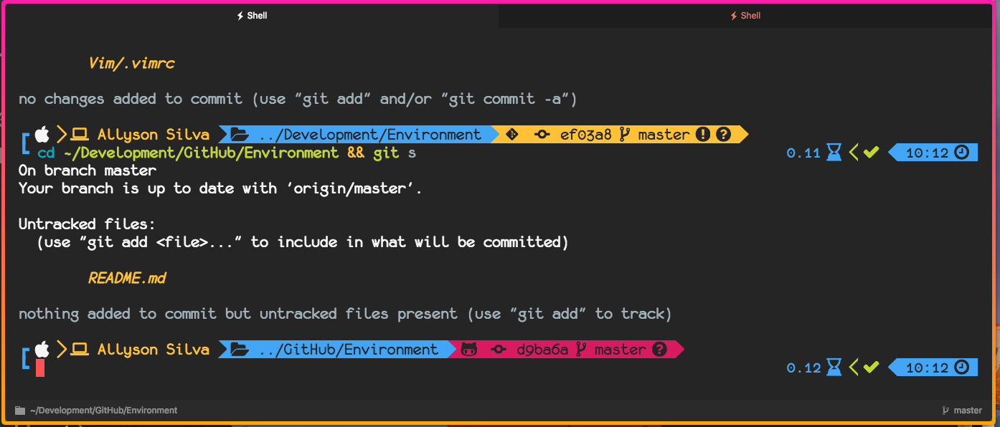

# My Environment ⚡️

## [Hyper.js - 1.4.8](https://hyper.is)

### Plugins

- [**hyperborder**](https://github.com/webmatze/hyperborder)
- [**hyper-statusline**](https://github.com/henrikdahl/hyper-statusline)
- [**hyper-tabs-enhanced**](https://github.com/henrikdahl/hyper-tabs-enhanced)
- [**hyper-dark-scrollbar**](https://github.com/moso/hyper-dark-scrollbar)
- [**hypergoogle**](https://www.npmjs.com/package/hypergoogle)
- [**gitrocket**](https://www.npmjs.com/package/gitrocket)
- [**hypergravity**](https://www.npmjs.com/package/hypergravity)
- [**space-pull**](https://www.npmjs.com/package/space-pull)
- [**hyperterm-panda**](https://www.npmjs.com/package/hyperterm-panda)
- ~~hyperterm-gruvbox~~
- ~~hyperterm-monokai~~
- ~~hyper-peacock~~
- ~~hyper-one-dark-vivid~~
- ~~hyper-frontend-delight~~
- ~~hyper-snazzy~~
- ~~hyper-chesterish~~
- ~~hyper-one-light~~

## License

[MIT License](github.com/AllysonSilva/environment/blob/master/LICENSE)
